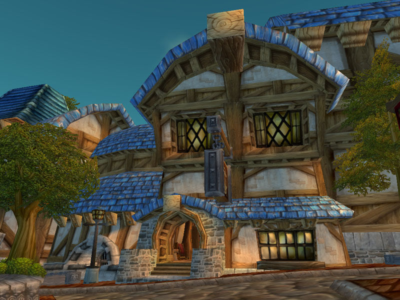
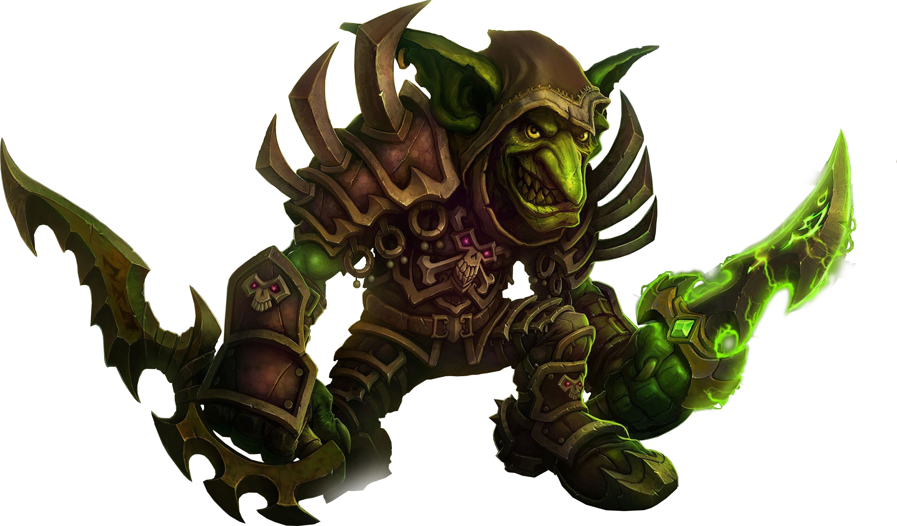

Gilded Rose (Επιχρυσωμένο Τριαντάφυλλο) 
======================================

Προδιαγραφές και απαιτήσεις
======================================

Kαλώς ήρθατε στο Gilded Rose. Όπως γνωρίζετε, είμαστε ένα μικρό πανδοχείο με προνομιακή τοποθεσία σε μία εξέχουσα πόλη. Υπεύθυνος για το πανδοχείο, είναι ένας φιλικός ξενοδόχος ο οποίος ονομάζεται Άλισον. 

Επίσης, αγοράζουμε και πουλάμε μόνο τα καλύτερα προϊόντα.
Δυστυχώς, η ποιότητα των προϊόντων μας μειώνεται καθώς αυτά πλησιάζουν την ημερομηνία πώλησής τους. Έχουμε ένα ηλεκτρονικό σύστημα το οποίο είναι υπεύθυνο για να ενημερώνει το απόθεμά μας.

Αναπτύχθηκε από έναν σοβαρό τύπο που ονομάζεται Leeroy, που έχει προχωρήσει σε νέες περιπέτειες. 

Ο στόχος σας είναι να επεκτείνετε το σύστημά που έχουμε, ούτως ώστε να μπορούμε να ξεκινήσουμε την πώληση μιας νέας κατηγορίας αντικειμένων. 

Πρώτα δύο λόγια για το σύστημά μας:

	Όλα τα αντικείμενα που πουλούμε έχουν μια τιμή SellIn (SellIn Value) που υποδηλώνει τον αριθμό των ημερών που έχουμε μέχρι να πουλήσουμε το αντικείμενο.
	- Όλα τα αντικείμενα έχουν μια τιμή Ποιότητας (Quality value) που υποδηλώνει πόσο πολύτιμο είναι το αντικείμενο
	- Στο τέλος κάθε ημέρας το σύστημά μας μειώνει και τις δύο τιμές για κάθε στοιχείο

Ακούγεται αρκετά απλό, έτσι? Λοιπόν, κάπου εδώ γίνεται πιο ενδιαφέρον:

	- Μόλις περάσει η ημερομηνία πώλησης/λήξης, η ποιότητα μειώνεται δύο φορές πιο γρήγορα σε σχέση με πριν.
	- Η ποιότητα (Quality value) ενός αντικειμένου δεν είναι ποτέ αρνητική
	- Η ποιότητα (Quality value) του "Aged Brie" αυξάνεται με τον καιρό
	- Η ποιότητα (Quality value)ενός αντικειμένου δεν είναι ποτέ μεγαλύτερη από 50
	- Το "Sulfuras", το οποίο είναι ένα θρυλικό αντικείμενο, δεν χρειάζεται ποτέ να πουληθεί και δεν μειώνεται σε ποιότητα
	- Τα "Backstage passes" (Εισητήρια για συναυλία), όπως και το "Aged Brie", αυξάνουν την ποιότητα τους καθώς πλησιάζει η αξία του SellIn. Η ποιότητα (Quality value) των "Backstage passes" αυξάνεται κατά 2 όταν υπάρχουν 10 ημέρες ή λιγότερες και κατά 3 όταν υπάρχουν 5 ημέρες ή λιγότερες, αλλά η ποιότητα πέφτει στο 0 μετά τη συναυλία.

Υπογράψαμε συμφωνία με ένα προμηθευτή, για να μπορούμε να πουλούμε `Conjured` items. 

Έτσι, το σύστημά μας τώρα χρειάζεται αναβάθμιση για να υποστηρίζει αυτά τα αντικείμενα.

	- Τα αντικείμενα "Conjured" (μαγικά πλασμένα) μειώνονται σε ποιότητα (Quality value) δύο φορές πιο γρήγορα σε σχέση με τα κανονικά αντικείμενα

Μπορείτε να κάνετε οποιεσδήποτε αλλαγές στη μέθοδο `UpdateQuality` και να προσθέσετε καινούριο κώδικα, εφόσον τα πάντα εξακολουθούν να λειτουργούν σωστά. Ωστόσο, μην αλλάξετε την κλάση `Item` ή το property/field `Items`.  Αυτά ανήκουν στο Goblin (καλικάντζαρο) στη γωνία που θα εξαγριωθεί και θα σε δαγκώσει καθώς δεν πιστεύει σε shared code ownership. Μπορείτε να κάνετε `static` τη μέθοδο `UpdateQuality` και το property `Items` αν θέλετε, θα σε προστατεύσουμε.

Μία διευκρίνιση: παρόλο που ποτέ, και για κανένα `Item`  δεν μπορεί ποτέ να αυξηθεί η ποιότητά του πάνω από 50, το `"Sulfuras"`, καθώς είναι ένα θρυλικό αντικείμενο η ποιότητά του είναι ίση με 80 και δεν αλλάζει ποτέ.

## World of Warcraft, Fun information

**Gilded Rose** is an [inn](https://wowwiki-archive.fandom.com/wiki/Inn) located in the [Trade District](https://wowwiki-archive.fandom.com/wiki/Trade_District). It is a popular [resting](https://wowwiki-archive.fandom.com/wiki/Rest) point for travelers passing through the [human](https://wowwiki-archive.fandom.com/wiki/Human) capital of [Stormwind City](https://wowwiki-archive.fandom.com/wiki/Stormwind_City) due to its proximity to the [bank](https://wowwiki-archive.fandom.com/wiki/Bank), [Auction House](https://wowwiki-archive.fandom.com/wiki/Auction_House), and an ever-popular [mailbox](https://wowwiki-archive.fandom.com/wiki/Mailbox). Its name is readable from the sign outside.

[Innkeeper Allison](https://wowwiki-archive.fandom.com/wiki/Innkeeper_Allison) is the host and offers a [Hearthstone](https://wowwiki-archive.fandom.com/wiki/Hearthstone) point as well as being a [vendor](https://wowwiki-archive.fandom.com/wiki/Vendor) of [food](https://wowwiki-archive.fandom.com/wiki/Food) and [drink](https://wowwiki-archive.fandom.com/wiki/Drink).

More: https://wowwiki-archive.fandom.com/wiki/Gilded_Rose

**Sulfuras, Hand of Ragnaros** is the weapon of choice for [Ragnaros](https://classic.wowhead.com/npc=11502) the Firelord.

**Conjured Item**

An [item](https://wowwiki-archive.fandom.com/wiki/Item) is **conjured** when it is created by an [ability](https://wowwiki-archive.fandom.com/wiki/Ability), [power](https://wowwiki-archive.fandom.com/wiki/Power) or [spell](https://wowwiki-archive.fandom.com/wiki/Spell). Conjured items function like normal items during play, but they disappear when the character logs out (or gets disconnected) for 15 minutes or more. Conjured items cannot be sold on the auction house nor to a vendor, although some can be traded to another character, and you could charge money for the conjured item in the trade.: https://wowwiki-archive.fandom.com/wiki/Conjured_item

**Goblin**
